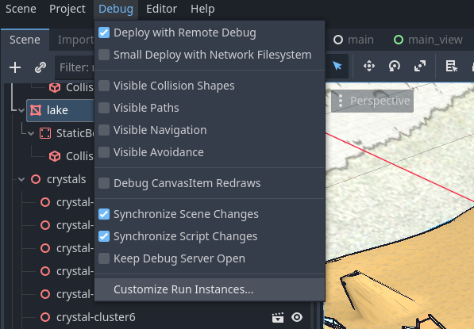
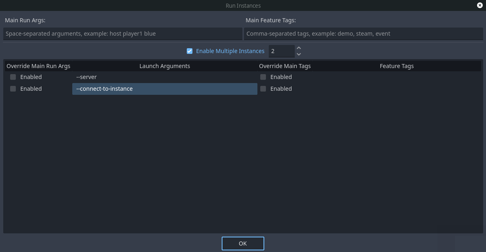

# QUICKSTART
The game requires both a server and a client to operate: Basically to Load levels and handle characters within levels.

The server(or backend) is a standalone application, which is also integrated into the application, which makes it possible
to host peer-to-peer.

## Bypass the backend through multiple instances

The simplest way to start the game is through multiple instances where one instance is given the role of the host,
and other one is the client(player) within the server.
This is made possible through runtime arguments for the game itself and through godot "Run Multiple Instances" option.

Multiple instances can be set from within the top menu, under `Debug/Customize Run Instances`.

Check the `Enable Multiple Instances` checkmark to activate this feature.
To bypass the backend through a game instance, set the `--server` and `connect-to-instance` agruments respectively.

After setting this, once the project starts two instances will pop up: a server, and a client; A level is going to be loaded and a character placed within.